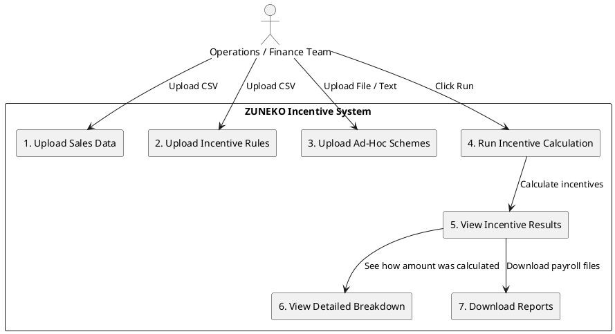

# 🚀 Full Stack Incentive Management System

This repository contains a **full-stack incentive calculation system**, with frontend and backend maintained as separate applications.  
It allows dealership groups to manage **structured** and **ad-hoc incentives** for sales employees, calculate totals per month, and view reports via dashboards.

---

## 📁 Project Structure

```
project-root/
├── backend/
│   └── README.md
├── frontend/
│   └── README.md
├── .vscode/
└── README.md
```

---

## 🚀 Running the Project (VS Code)

Use **Run & Debug** (`Ctrl + Shift + D`) and select:

1. Backend Only  
2. Frontend Only  
3. Frontend + Backend  

---

## 🌐 URLs

- **Frontend:** [http://localhost:5500](http://localhost:5500)  
- **Backend:** [http://localhost:8000](http://localhost:8000)  

---

## ⚙ Tech Stack

### Backend:
- Python, FastAPI, MySQL, PyMySQL  
- Pandas for in-memory calculations  

### Frontend:
- HTML, CSS, JavaScript  
- Node.js, Express  

---

## 🗄 Data Storage Architecture

- **Database Schema Structure:** See `schemas.sql` in the backend folder.  
- **Why PyMySQL + MySQL Works:**  
  - Relational design supports joins, indexes, and constraints.  
  - JSON fields can store structured calculation details.  
  - PyMySQL allows batch inserts and transactions with `conn.commit()` and `cursor.execute()`.  

### Indexing Strategies:
- Index on `employee_id`, `sale_date`, `role`, `vehicle_type`  
- Partition historical calculation tables by month/year for 24M+ rows  

---

## 📜 Rule Engine Design

### 1️⃣ Managing 500+ Rules Efficiently
- Store **structured rules** and **ad-hoc rules** in separate tables (`structured_rules`, `ad_hoc_rules`)  
- Include:  
  - Role, vehicle type, min/max units, bonus, validity dates  
  - `upload_file_id` for traceability  
  - `rule_version` for versioning  
- Pre-load all rules into memory using **pandas DataFrames** for bulk calculations  
- Index frequently queried columns: `role`, `vehicle_type`, `valid_from`, `valid_to`  

### 2️⃣ Rule Versioning
- Use `rule_version` or `valid_from/valid_to` to store historical rules  
- Query rules valid for the target period:
```sql
SELECT * FROM structured_rules
WHERE valid_from <= %s AND valid_to >= %s;
```
- Keep old rules for historical calculations  

### 3️⃣ Resolving Conflicting Rules
- Add a `priority` column → higher priority overrides lower  
- Most specific rule wins (exact match on vehicle/role)  
- Optionally, sum all applicable rules if cumulative bonuses are allowed  
- Log all applied rules per sale in JSON for auditing  

### 4️⃣ Rules Engine Implementation
| Option | Pros | Cons | Recommendation |
|--------|------|------|----------------|
| Drools / Commercial engine | Handles complex rules, conflicts, versioning | Java-based, not Python-native | Not needed unless rules are extremely complex |
| Custom Python | Fully controllable, integrates with FastAPI + pandas | Must handle conflicts and versioning carefully | Recommended: Current pandas + PyMySQL approach |

---

## 🧮 Calculation Performance

### 1️⃣ Naive Algorithm Problem
Looping through each employee × each rule → O(n × m)  
Example: 1M employees × 500 rules = 500M iterations → very slow  

### 2️⃣ Performance Optimization Strategies

**a) Pre-computation:**  
Aggregate sales per employee, role, vehicle type before applying rules:
```python
df_sales_agg = df_sales.groupby(['employee_id', 'role', 'vehicle_type'])                        .agg({'quantity': 'sum'}).reset_index()
```

**b) Caching:**  
Cache rules in memory (pandas DataFrame or Python dict).  
Use Redis if cross-process caching is needed.  

**c) Parallel Processing:**  
Split employees into batches and process in parallel using `multiprocessing` or `concurrent.futures`.  
Example: 1M employees → 10 parallel workers → 10× speedup  

**d) Vectorized Calculations:**  
Use pandas merges and vectorized operations instead of row-by-row loops:
```python
df_rules_applied = pd.merge(df_sales_agg, df_rules, on=['role', 'vehicle_type'])
df_rules_applied = df_rules_applied[
    (df_rules_applied['quantity'] >= df_rules_applied['min_units']) &
    (df_rules_applied['quantity'] <= df_rules_applied['max_units'])
]
df_rules_applied['structured_amount'] = df_rules_applied['incentive_amount_inr'] +                                         (df_rules_applied['quantity'] - df_rules_applied['min_units']).clip(lower=0) *                                         df_rules_applied['bonus_per_unit_inr']
```

**e) Incremental Calculations:**  
Only process new or updated sales since the last calculation:  
- Add `calculated_flag` column in `sales_transactions`  
- Query only where `calculated_flag = 0` or `sale_date > last_calc_date`  

---

## 📄 Text Parsing at Scale
- **Problem:** Manual PDF parsing is slow and error-prone  
- **Solutions:**  
  - OCR (Tesseract / AWS Textract / Google Vision) → convert PDFs/images to text  
  - NLP / ML Pipelines: Regex, NER, or ML models to extract schemes, roles, bonuses, and conditions  
  - Template-Based Parsing for standard layouts (more accurate than OCR+NLP)  

- **Validation:**  
  - Auto-check numeric fields, date ranges, and role/vehicle consistency  
  - Human-in-the-loop validation for low-confidence extractions  
  - Keep original PDF for auditing  

---

## ⏱ Real-Time vs Batch Processing
- **Monthly batch:** Simple, deterministic, easy to audit  
- **Real-time calculation:** Optional for dashboards or top-performer alerts; complex for full payroll  
- **Streaming (Kafka):** Near real-time metric updates while batch handles payroll  
- **Recommendation:** Monthly batch + optional real-time KPI dashboard  

---

## 🏢 Multi-Tenancy
- Row-level security (add `group_id` or `branch_id`) for multiple dealerships → cost-efficient  
- Separate DB instances for high-value clients  
- Ensure all queries are filtered by tenant to avoid data leaks  

---

## ❓ Handling Uncertainty in Rules
- Extract structured rules using NLP/ML  
- Assign confidence scores; low-confidence rules need human validation  
- Ambiguous rules → mark as "manual review required"  
- Store original text + parsed rule for auditing and dispute resolution  

---

## 📊 Auditability & Compliance
- Store full calculation logs per employee (sales, rules applied, totals)  
- Provide detailed breakdown reports for HR/finance  
- Retain audit logs for 3–5 years; keep original PDFs  
- Mask/encrypt PII; enforce access control (GDPR-compliant)  

---

## 🧩 ER Diagram (PlantUML)
```plantuml
@startuml
entity uploaded_files { id : UUID <<PK>>, file_name, file_type, uploaded_at, created_at }
entity sales_transactions { id : UUID <<PK>>, employee_id, branch, role, vehicle_model, vehicle_type, quantity, sale_date, upload_file_id <<FK>>, created_at }
entity structured_incentive_rules { id : UUID <<PK>>, role, vehicle_type, min_units, max_units, base_incentive_amount, bonus_per_unit, valid_from, valid_to, status, upload_file_id <<FK>>, created_at }
entity adhoc_incentive_rules { id : UUID <<PK>>, scheme_name, rule_description, applies_to, priority, valid_from, valid_to, confidence_level, status, upload_file_id <<FK>>, created_at }
entity calculation_runs { id : UUID <<PK>>, calculation_month, branch, started_at, completed_at, status, created_at }
entity incentive_results { id : UUID <<PK>>, run_id <<FK>>, employee_id, total_units_sold, structured_incentive_amount, adhoc_incentive_amount, total_incentive_amount, status, created_at }
entity incentive_rule_applications { id : UUID <<PK>>, result_id <<FK>>, rule_id, rule_type, calculation_details, incentive_amount, created_at }

uploaded_files ||--o{ sales_transactions
uploaded_files ||--o{ structured_incentive_rules
uploaded_files ||--o{ adhoc_incentive_rules
calculation_runs ||--o{ incentive_results
incentive_results ||--o{ incentive_rule_applications
@enduml
```

---

## 🏗 System Architecture

### User Flow (Non-Technical)


### Technical Architecture
```plantuml
@startuml
actor User as "Ops / Finance User"
package "Frontend" { component Dashboard; component Upload_Data_UI; component Run_Calculation_UI; component Incentive_Results_UI; component Incentive_Breakdown_View }
package "Backend (FastAPI)" { component API_Gateway; component File_Ingestion_Service; component Validation_Engine; component Structured_Rules_Parser; component Adhoc_Rules_Parser; component Rule_Store; component Calculation_Engine; component Conflict_Resolver; component Exception_Handler; component Export_Service }
database Relational_DB
database File_Storage
User --> Dashboard
User --> Upload_Data_UI
User --> Run_Calculation_UI
User --> Incentive_Results_UI
User --> Incentive_Breakdown_View
Upload_Data_UI --> API_Gateway
Run_Calculation_UI --> API_Gateway
Incentive_Results_UI --> API_Gateway
API_Gateway --> File_Ingestion_Service
File_Ingestion_Service --> Validation_Engine
Validation_Engine --> Structured_Rules_Parser
Validation_Engine --> Adhoc_Rules_Parser
Structured_Rules_Parser --> Rule_Store
Adhoc_Rules_Parser --> Rule_Store
File_Ingestion_Service --> File_Storage
Validation_Engine --> Relational_DB
API_Gateway --> Calculation_Engine
Calculation_Engine --> Rule_Store
Calculation_Engine --> Relational_DB
Calculation_Engine --> Conflict_Resolver
Calculation_Engine --> Exception_Handler
Exception_Handler --> Relational_DB
API_Gateway --> Export_Service
Export_Service --> Relational_DB
Export_Service --> File_Storage
@enduml
```

---

## 🧮 Incentive Calculation Logic

1. **Fetch total sales per employee & vehicle type for the month:**
```sql
SELECT employee_id, vehicle_type, SUM(quantity) AS total_quantity
FROM sales_transactions
WHERE sale_date BETWEEN '2025-09-01' AND '2025-09-30'
GROUP BY employee_id, vehicle_type;
```

2. **Apply Structured Rules:**  
Structured Amount = Base Amount + (Units Sold - Min Units) × Bonus Per Unit  

Example:

| Vehicle Type | Units | Structured Amount |
|--------------|-------|-----------------|
| Compact      | 12    | ₹11,500         |
| Mid-Size     | 10    | ₹13,800         |
| SUV          | 8     | ₹15,000         |
| Commercial   | 15    | ₹7,000          |

Structured Total: ₹47,300  

3. **Apply Ad-Hoc Rules:**  

| Scheme Name | Amount |
|------------|--------|
| Branch Target Achievement | ₹10,000 |
| Consistency Reward        | ₹4,000  |

Ad-Hoc Subtotal: ₹14,000  

4. **Total Incentive:** ₹61,300  

5. **Store calculation in `incentive_calculations` table with breakdown JSON**  

---

## 👩‍💻 Relevant Experience

- Built full-scale **incentive engines** for sales teams  
- Backend: FastAPI + PyMySQL, with robust transaction management  
- Frontend: Interactive dashboards for uploading, calculation, and reporting  

**💡 Approach:**  
Systems that are **accurate, transparent, scalable**, and **easy for end-users**  
