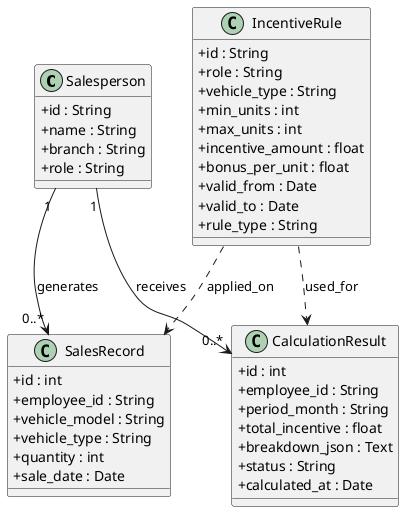
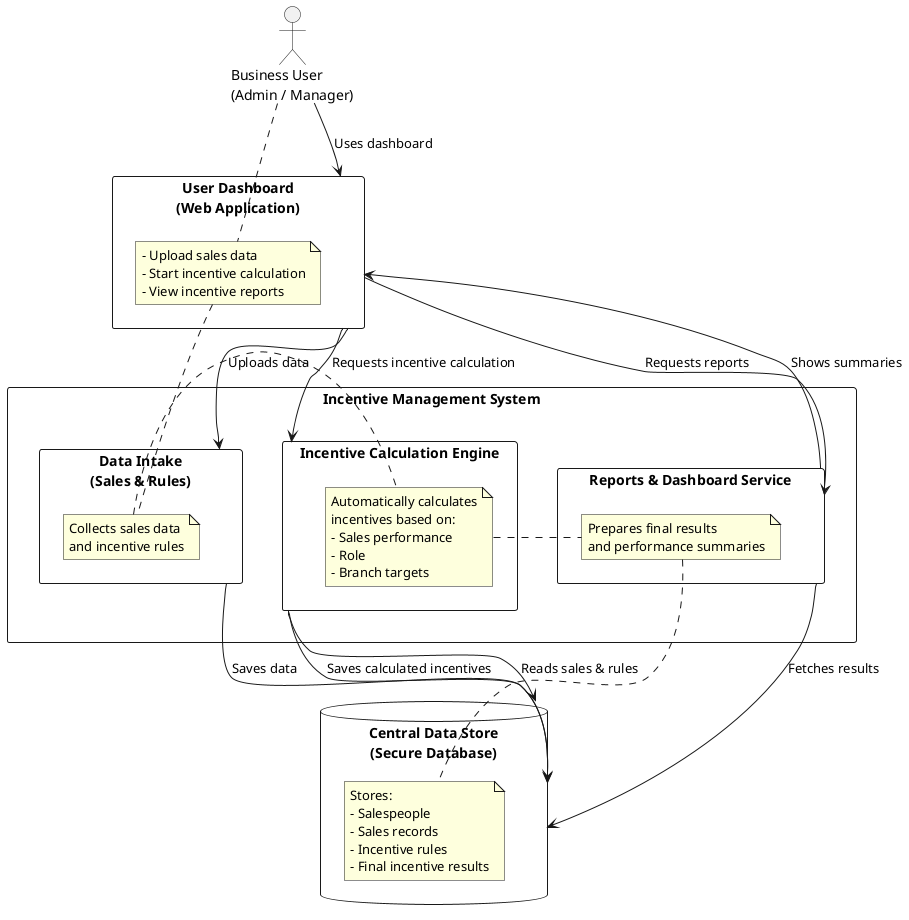

# 🚀 Full Stack Incentive Management System

This repository contains a **full-stack incentive calculation system**,  
with frontend and backend maintained as separate applications.

---

## 📁 Project Structure

```
project-root/
├── backend/
├── frontend/
├── .vscode/
└── README.md
```

---

## 🚀 Running the Project (VS Code)

Use **Run & Debug** (`Ctrl + Shift + D`) and select:

- Backend Only  
- Frontend Only  
- Frontend + Backend  

---

## 🌐 URLs

- **Frontend:** http://localhost:5500 
- **Backend:** http://localhost:8000  

---

## ⚙ Tech Stack

**Backend:**
- Python
- FastAPI
- MySQL

**Frontend:**
- HTML, CSS, JavaScript
- Node.js, Express

---

## 🧩 Class Diagram (PlantUML)



---

## 🏗 System Architecture (Non-Technical)

This system allows **business users** to upload sales data and incentive rules,  
trigger calculations, and view reports.  

**Main components:**
- **Frontend UI:** Dashboard for uploading data and viewing reports
- **Data Intake:** Validates and stores sales & rule data
- **Incentive Calculation Engine:** Calculates incentives per employee based on rules
- **Reports & Dashboard Service:** Prepares results for visualization
- **Database:** Stores all master data, sales records, rules, and calculation results



---

## 🧮 Incentive Calculation Logic

1. **Validate period** (YYYY-MM)  
2. **Load sales data** for selected period  
3. **Load active incentive rules** for period  
4. **Calculate structured incentives** per employee:
   - Count units per vehicle type
   - Apply base slab and bonus per extra unit
5. **Calculate ad-hoc / branch achievement bonuses**
6. **Store calculation results** in database (with JSON breakdown)

---

## ✅ Output

- Incentive per employee  
- Rule-wise breakdown  
- Dashboard-ready aggregated data  

---

## 📈 Experience with Scale & System Design Considerations

This project is designed for **real-world incentive systems**, handling large datasets, complex rules, and performance considerations.

**Experience with Incentive / Commission Systems:**
- Role-based incentives (ASM, RM, etc.)  
- Vehicle-type-based incentive slabs  
- Time-bound rules  
- Branch-level performance incentives  
- Monthly aggregation and recalculation  

**Handling Rule Engines at Scale:**
- Rule isolation and dynamic evaluation  
- Filtering rules by time window  
- Deterministic selection of best matching slab  
- Supports structured and ad-hoc rules  

---

## 👩‍💻 My Relevant Experience

I’ve designed and implemented this system drawing from hands-on experience in **sales performance and commission management**.  

### 1️⃣ Incentive & Commission Systems
- Built full-scale incentive engines for sales teams  
- Implemented role-based and branch-based rules  
- Transparent and auditable calculations  

### 2️⃣ Rule Engines & Business Logic
- Scalable rule evaluation for large datasets  
- Dynamic rules based on role, vehicle type, branch targets  
- Rules can be updated without affecting historical calculations  

### 3️⃣ Data Handling & Parsing
- Structured CSV inputs for sales data and rules  
- Robust validation and error handling  

### 4️⃣ Backend & API Development
- FastAPI REST APIs for data upload, calculation, and reporting  
- Robust transaction management and logging  

### 5️⃣ Frontend & User Experience
- Interactive dashboards for uploading, calculation, and reporting  
- User-friendly and intuitive design  

### 6️⃣ Scalability & Performance
- Optimized for large datasets with batch processing, caching, and stateless design  
- High-volume incentive calculations supported  

**💡 My Approach:**  
I focus on building systems that are **accurate, transparent, scalable**, and **easy for end-users**.

---

